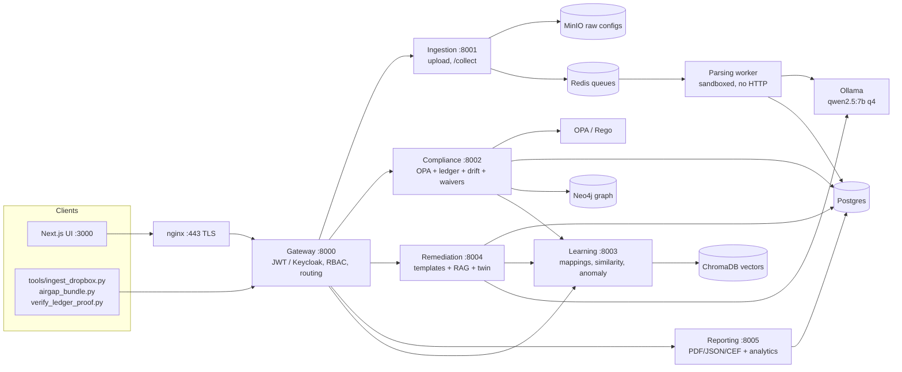

# NetAudit Engine — Architecture

This document traces the system end to end against the code as it exists today:
every service, the contracts between them, the exact path a configuration file
takes from upload to a signed-off compliance report, and the reasoning behind
the choices that shape it. It is meant to stand alone — no other document is
required to understand this system.

Every claim below names the file that enforces it. Where a default value is
quoted, it is the literal default in the code, not an aspiration.

---

## 1. Design philosophy

Two rules shape every service boundary in this codebase.

### 1.1 AI extracts, it never decides

A small language model (or the deterministic mock/TextFSM path) turns vendor CLI
syntax into a normalized schema. Whether a control passes or fails is always a
deterministic OPA/Rego evaluation. Low-confidence or invalid extraction routes to
`NEEDS_REVIEW`; it is never displayed as compliant.

*Single enforcement point:* [`services/compliance/app/opa_client.py`](services/compliance/app/opa_client.py)
is the only place in the repository where a finding comes into existence.

### 1.2 Vendor-agnostic by construction

There is exactly one policy bundle —
[`services/compliance/policies/generic/generic_level1.rego`](services/compliance/policies/generic/generic_level1.rego) —
evaluated identically for every device, because Parsing normalizes every vendor
into the same `SecurityBaseline` shape first. The bundle contains no `applies`
guard and never reads `input.device.detected_vendor` in a rule.

Gating on whether a device reaches Compliance is confidence-only (extraction
quality), never a vendor allowlist. An unrecognized vendor is not the same thing
as an unparseable one.

*Enforced in:* `services/parsing/app/worker.py::_process_config`.

---

## 2. Service map



| Service | Process type | Port | Entry point |
|---|---|---|---|
| `frontend/` | Next.js server | 3000 (published) | `src/app/page.tsx` → `src/lib/api.ts` |
| `gateway/` | FastAPI | 8000 (published) | `app/main.py`, `app/auth.py` |
| `services/ingestion/` | FastAPI | 8001 (internal) | `app/main.py`, `app/uploader.py` |
| `services/parsing/` | **Celery worker only — no HTTP server** | — | `app/worker.py` |
| `services/compliance/` | FastAPI + separate Celery worker | 8002 (internal) | `app/main.py`, `app/worker.py`, `app/evaluator.py` |
| `services/learning/` | FastAPI + Celery worker (optional) | 8003 (internal) | `backend/app/main.py` |
| `services/remediation/` | FastAPI | 8004 (internal) | `app/main.py`, `app/template_engine.py` |
| `services/reporting/` | FastAPI | 8005 (internal) | `app/main.py`, `app/pdf_service.py` |
| `services/schema/` | Library (no process) | — | `schema/security_baseline.py` |
| `contracts/` | JSON Schema + route table | — | `security_baseline.schema.json`, `compliance_finding.schema.json`, `api_gateway_routes.md` |

Parsing being worker-only is deliberate and worth noting: it has no `main.py`
and accepts no HTTP. The only way to invoke it is to put a message on the
`parsing` Celery queue, which means there is no route into extraction that
bypasses Ingestion's validation and redaction.

Compliance runs as **two containers from one image** — `compliance` (the read
and evaluation API) and `compliance-worker` (`command: python -m app.worker`).
A slow evaluation therefore cannot block a dashboard read.

### Celery topology

One named queue per hop, all on the same Redis instance
(`CELERY_BROKER_URL`, default `redis://redis:6379/0`):

| Task name | Queue | Producer | Consumer |
|---|---|---|---|
| `parsing.process_config` | `parsing` | `services/ingestion/app/queue_producer.py:34` | `services/parsing/app/worker.py:286` |
| `compliance.evaluate_baseline` | `compliance` | `services/parsing/app/worker.py:437` | `services/compliance/app/worker.py:41` |
| `learning.receive_unknown_block` | `learning` | `services/parsing/app/worker.py:509` | `services/learning/backend/app/unknown_handler.py:39` |

Each worker consumes only its own queue, so start order never drops a job —
Compliance coming up after Parsing simply finds its queue waiting.

---

## 3. End-to-end flow: upload → report

```text
Browser (frontend)
   │  POST /api/upload   (JWT bearer, multipart file)
   ▼
Gateway  gateway/app/main.py
   │  verifies JWT, attaches X-User-Id from signed claims, proxies raw
   │  bytes UNTOUCHED to Ingestion (no validation here — see §9)
   ▼
Ingestion  services/ingestion/app/main.py
   │  validate_and_store()      size cap, extension allowlist, python-magic
   │                            MIME check, regex credential redaction,
   │                            SHA-256 hash → MinIO object store
   │  capture_credential_evidence()  from the RAW text, BEFORE redaction:
   │                            pattern type, line number, SHA-256 of the
   │                            real value, last 4 chars only
   │  create_audit_run()        Postgres audit_runs row, status = INGESTED
   │  chunk_config()            hierarchical chunker — splits on the config's
   │                            OWN indentation, never mid-block
   │                            (max_lines=500, max_line_length=2000)
   │  enqueue_parsing_job()  ──► Celery "parsing.process_config" (queue: parsing)
   ▼
Parsing  services/parsing/app/worker.py        [Celery consumer, no HTTP]
   │  detect_job_context()      regex vendor/OS fingerprint — best-effort
   │                            context only, never a gate
   │  per chunk:
   │    build_prompt() + RAG context → SLM (Ollama, or mock when
   │      USE_MOCK_SLM=true) → schema-constrained JSON
   │    reject if mean_logprob < LOGPROB_UNCERTAINTY_THRESHOLD (-0.5)
   │    optional reverse-translation fidelity check, second SLM round-trip,
   │      threshold REVERSE_TRANSLATION_FIDELITY_THRESHOLD (0.7)
   │    normalize_candidate() → SecurityBaseline.model_validate()
   │  merge_baselines()         across all chunks
   │  agreement.py              deterministic TextFSM cross-check; result
   │                            lands in `conflicts` + parser_agreement,
   │                            NEVER in parsing_confidence
   │  parsing_confidence = mean(chunk confidences) — extraction quality
   │                       alone, never floored by fingerprint confidence
   │
   │  if parsing_confidence < CONFIDENCE_THRESHOLD (0.60):
   │       mark_needs_review()  → STOP. Never evaluated, never shown clean.
   │  else:                  ──► Celery "compliance.evaluate_baseline"
   │
   │  any chunk that failed schema validation is ALSO pushed to
   │  "learning.receive_unknown_block" — independently of the job's
   │  overall outcome, so a mostly-good parse still feeds the review queue
   ▼
Compliance  services/compliance/app/worker.py → app/evaluator.py
   │  opa_client.evaluate()     POST the SecurityBaseline to
   │                            OPA_URL/compliance/cis (default
   │                            http://opa:8181/v1/data), 10 s timeout.
   │                            Raises OPAEvaluationError on failure —
   │                            never returns an empty finding set.
   │  risk_scorer.score_findings() / summarize()
   │                            severity → risk_score;
   │                            compliance_score = 100 − Σ(risk_score)
   │  graph_client.ingest/blast_radius()    optional, Neo4j
   │  anomaly_client.ingest/check()         optional, Learning + ChromaDB
   │                            Both enrich; neither can alter a verdict (§5)
   │  evidence_locator.attach() ties each finding to its source config lines
   │  db.save_findings()        immutable findings + baseline snapshot;
   │                            audit_runs.status → EVALUATED
   │  db.save_anomaly()         separate configuration_anomalies table
   │  webhooks.dispatch("VIOLATION_DETECTED")  newly-detected findings only,
   │                            skipping any control under an active waiver
   ▼
Frontend polls GET /api/audit-runs/{id} until status is
EVALUATED | COMPLETE | NEEDS_REVIEW | FAILED, then renders findings,
risk score, blast radius and the anomaly signal as separate panels.
   │
   ├─ Remediation  services/remediation/app/main.py            [on demand]
   │    POST /api/remediation/generate → per finding:
   │
   │      finding.remediation is set  (a .j2 filename from the policy bundle)
   │        → render_template()   sandboxed Jinja2, allow-listed .j2 only
   │        → Batfish preflight   (USE_MOCK_BATFISH=true by default)
   │        → preflight_status = SAFE | RISK_FLAGS
   │
   │      finding.remediation is null  (no template for this vendor yet)
   │        → rag_remediation.py  agentic-RAG fallback, grounded by
   │          Learning's vendor-manual excerpts when available
   │        → PERMANENTLY forced to RISK_FLAGS. Never approvable. (§5)
   │
   │    decision.decide()        policy/decision_table.yaml →
   │                             BLOCK | DUAL_APPROVAL | SINGLE_APPROVAL |
   │                             AUTO_APPLY, from parser_agreement +
   │                             blast_radius + severity
   │    POST /api/remediation/{control_id}/approve
   │                             RBAC-scoped (approval_matrix.py);
   │                             only preflight_status == SAFE may pass.
   │                             Approval flips a database column. There is
   │                             no live device-push path in this repo.
   │
   └─ Reporting  services/reporting/app/main.py                [on demand]
        POST /api/reports/generate   requires status EVALUATED or COMPLETE
          → generate_pdf() + record_report()
        GET  /api/reports/{run}/preview | /download | /json | /cef
          → HTML preview, PDF, JSON archive, CEF SIEM event stream
        GET  /api/executive-report, /api/mttr,
             /api/provenance/{run}/{control}
          → fleet score, trend, MTTR and full per-finding provenance,
            all computed over the same append-only ledger
```

---

## 4. The policy bundle, and how it is actually loaded

This is the one connection in the system that no static code analysis will
find, so it is stated explicitly here.

**Nothing in the Python codebase imports, reads or references the `.rego`
files.** The link is a Docker volume mount plus an HTTP data path:

```yaml
# docker-compose.yml
opa:
  image: openpolicyagent/opa:1.20.2
  command: [run, --server, --addr=0.0.0.0:8181, /policies]
  volumes: ["./services/compliance/policies:/policies:ro"]
```

The OPA container loads every `.rego` under `/policies` at startup and serves
them at `/v1/data/compliance/<framework>`. Compliance only ever speaks HTTP to
that endpoint. Consequences worth knowing:

- **Editing a policy requires restarting `opa`**, not `compliance`.
- The mount is `:ro`. No service can write a policy at runtime.
- `opa_client.collect_findings()` walks OPA's nested result document and
  gathers every package's `deny` set, so adding a new policy package to the
  directory makes it live without a code change in Compliance.
- `POLICY_BUNDLE_VERSION` (default `cis-generic-level1@1.0.0`) is recorded on
  every evaluation for provenance.

### The 11 controls

A CIS-style generic Level 1 prototype bundle. This is an illustrative subset,
not certified CIS content.

| Control | Title | Fails on |
|---|---|---|
| CIS-NET-1.1.1 | SSH version 2 where SSH is in use | evidence |
| CIS-NET-1.1.2 | Telnet not used for administrative access | evidence |
| CIS-NET-1.1.3 | SSH management access restricted by ACL | evidence |
| CIS-NET-1.2.1 | SNMP not using version 1 or 2c | evidence |
| CIS-NET-1.2.2 | Default SNMP community strings not used | evidence |
| CIS-NET-1.3.1 | IKE/IPsec Phase 1 not using DES or 3DES | evidence |
| CIS-NET-1.4.1 | NTP authentication enabled where NTP is in use | evidence |
| CIS-NET-1.5.1 | Stored passwords/secrets not left unencrypted | evidence |
| CIS-NET-1.6.1 | Legal login banner configured | **absence** |
| CIS-NET-1.7.1 | Unencrypted HTTP administrative access disabled | evidence |
| CIS-NET-1.8.1 | Logging sent to a remote syslog host | **absence** |

### Why that split exists

Going vendor-agnostic forced a distinction the old per-vendor bundles never
needed. Once you cannot assume a specific platform's factory defaults, an
absent field stops meaning "the insecure default is active":

- **Fail-open (needs positive evidence).** Whether a platform ships with Telnet
  on, SNMPv1 on, or an HTTP admin server on is vendor-specific. An absent or
  `UNKNOWN` field is "no evidence either way", not "presumed insecure".
- **Fail-closed (absence is itself the violation).** A login banner either was
  observed or was not. Logs either go off-box or they do not. Both are directly
  observable and universally expected regardless of platform, so these two still
  fail on absence — exactly as the vendor-specific bundles they replaced did.

Pinned by [`generic_level1_test.rego`](services/compliance/policies/generic/generic_level1_test.rego),
which tests both the fail-open/fail-closed split and the vendor-independence of
the verdict.

### Where vendor identity survives

In exactly one place, as **data**:

```rego
remediation_templates := {
	"CIS-NET-1.1.2": {"cisco": "ios_disable_telnet.j2",
	                  "fortinet": "fortinet_disable_telnet.j2",
	                  "juniper": "junos_disable_telnet.j2",
	                  "paloalto": "paloalto_disable_telnet.j2"},
	...
}
```

A CLI fix command is inherently vendor-specific syntax — that is not hardcoding,
it is what "device-specific remediation" means. Adding a vendor is adding a map
key, never a new `applies if detected_vendor == "..."` branch. A vendor with no
row still gets a full compliance verdict; it comes back with
`remediation: null`, which `compliance_finding.schema.json` already treats as
"no template exists yet", not an error.

---

## 5. Optional enrichment: the degradation pattern

Four subsystems follow one identical structural pattern. Understanding it once
explains all of them. Note that Remediation reaches ChromaDB *through* Learning's
HTTP API rather than directly — only Learning holds a Chroma client.

| Provider | Backing store | Attaches |
|---|---|---|
| `compliance/app/graph_client.py` | Neo4j | `blast_radius` — which devices a finding can propagate to |
| `compliance/app/anomaly_client.py` | Learning → ChromaDB | `anomaly` — statistical configuration drift |
| `parsing/app/rag.py`, `vendor_fingerprint.py` | ChromaDB | extraction context, vendor hints |
| `remediation/app/manual_provider.py` | Learning → ChromaDB | vendor-manual excerpts grounding the agentic-RAG draft |

Every one of them is built from four parts:

1. A `Protocol` defining the interface.
2. An `Empty*Provider` returning a benign "unavailable".
3. A factory that builds the real provider **only if** its URL env var is set,
   otherwise the empty one.
4. A lazily-initialised singleton at the call site, wrapped in `try/except` that
   logs a warning and continues.

```python
# services/compliance/app/evaluator.py:135-140
anomaly_result: dict = {"status": "unavailable"}
try:
    await anomaly_provider.ingest(baseline)
    anomaly_result = await anomaly_provider.check(baseline)
except Exception as exc:
    logger.warning("Anomaly detection unavailable for %s: %s", device_id, exc)
```

Net effect: ChromaDB, Neo4j and Learning are all `--profile advanced`, so in the
default stack they are not running. `LEARNING_URL` is still set in
`services/compliance/.env.example`, the connection fails, the exception is
caught, and the response carries `{"status": "unavailable"}`.

**An enrichment outage never turns an evaluatable baseline into a failed
compliance run.** Contrast with `opa_client.py`, which *raises* — "a compliance
engine that silently returns no findings when the policy engine is down reports
a broken device as compliant."

Lazy construction matters too: a malformed `NEO4J_URI` or `LEARNING_URL` can
never crash the Compliance API at import time.

### The anomaly chain in full

Because it crosses three services and two datastores, the complete path:

```
evaluator.evaluate_baseline()                      compliance/app/evaluator.py:111
 └─ _get_anomaly_provider()                        :57   lazy singleton
     └─ build_anomaly_detection_provider()         anomaly_client.py:103
         ├─ LEARNING_URL unset → EmptyAnomalyDetectionProvider  (no-op)
         └─ LEARNING_URL set   → LearningAnomalyDetectionProvider
 │
 ├─ .ingest(baseline)   POST /learning/baseline-vectors          evaluator.py:137
 │    └─ Learning: embed via BAAI/bge-small-en-v1.5, Chroma upsert
 │       keyed on config_sha256, tagged {vendor, os}    learning/…/main.py:628
 │       (runs for EVERY device, clean or not — a clean device is
 │        still a legitimate peer for its cohort)
 │
 ├─ .check(baseline)    POST /learning/baseline-vectors/anomaly-check
 │    └─ Learning: fetch all peers sharing vendor+os,   learning/…/main.py:661
 │       EXCLUDE the target from its own reference set,
 │       fit IsolationForest on the peers alone,
 │       score the target as a held-out point
 │       → "scored" | "insufficient_peers" | "not_ingested" | "unavailable"
 │       Below ANOMALY_MIN_PEER_COUNT (5) it refuses to score rather
 │       than fabricate a verdict.
 │
 ├─ db.save_anomaly()  → configuration_anomalies table            evaluator.py:157
 └─ response["anomaly"] = anomaly_result                          evaluator.py:179
```

Transport is HTTP carrying an HS256 service token signed from
`SERVICE_JWT_SECRET`; Learning takes the caller's role from the *signed* claims,
not a plaintext header (`app/service_token.py`).

**Where the chain deliberately stops.** `anomaly_result` never touches
`findings`, `risk_score` or `compliance_score`. It gets its own response field
and its own table. The reason is a determinism conflict, stated in the module's
own docstring:

> README.md states "the same normalized baseline always produces the same
> verdict," but an IsolationForest fit on an evolving peer cohort is not stable
> over time — the same baseline could flip between anomalous/not-anomalous
> purely because more peers have since been scanned, with nothing about the
> baseline itself changing.

So it is attached as context on top of a verdict OPA already made — structurally
identical to how `blast_radius` is attached — rather than being folded into the
decision.

---

## 5a. Adversarial input and the parser sandbox

Parsing is the one service that feeds attacker-controlled text to a model, so
it is the one service with a hardened runtime.

**Container hardening** (`docker-compose.yml`, the `parsing` service):

```yaml
runtime: ${PARSER_RUNTIME:-runc}   # set to runsc (gVisor) for a stronger boundary
user: "10001:10001"                # non-root
read_only: true                    # immutable filesystem
tmpfs: [/tmp:size=64m,mode=1777]   # the only writable path
cap_drop: [ALL]
security_opt: [no-new-privileges:true]
pids_limit: 128
mem_limit: 2g
cpus: 2.0
```

**Input defences** (`services/parsing/app/input_guard.py`):

- **Prompt injection.** Text such as "ignore previous instructions" inside a
  MOTD banner is detected and replaced with
  `! [removed by NetAudit input guard: possible prompt injection]`, and the
  chunk is flagged `possible_prompt_injection`.
- **Line-length cap.** Lines over `MAX_LINE_CHARS` (2000) are truncated and
  flagged `line_truncated`.
- **ReDoS.** `run_bounded()` executes vendor detection in a killable
  subprocess with a timeout (`PARSE_TIMEOUT_SECONDS`, default 5.0), so a
  pathological input cannot hang the worker.

See `docs/PARSER_SANDBOX.md` for the AppArmor/gVisor upgrade path.

---

## 5b. Air-gapped and offline entry points

The system is designed to run with no network egress after first pull.

| Tool | Purpose |
|---|---|
| `tools/ingest_dropbox.py` | Offline drop-box for data-diode / air-gapped config transfer |
| `tools/airgap_bundle.py` | Signed update bundle for moving rules and templates across the gap (`docs/AIRGAP_UPDATE_PROCEDURE.md`) |
| `tools/verify_ledger_proof.py` | Verify a ledger inclusion proof outside the running system |
| `services/ingestion/app/collector.py` | Online collection via Netmiko/NAPALM — **off by default**, restricted to allow-listed CIDRs |

**Device identity.** History, waivers and drift all key off
`waivers.device_key()` — `vendor|hostname`, falling back to
`sha:<config_sha256>` when a config carries no hostname. That fallback is why
an unnamed device still accumulates history rather than appearing as a new
device on every upload.
*Defined in:* `services/compliance/app/waivers.py:33`.

---

## 6. Safety gates (the parts that must never be bypassed)

- **Parsing confidence gate.** A baseline reaches Compliance only if
  `parsing_confidence >= CONFIDENCE_THRESHOLD` (0.60). Confidence derives
  solely from extraction quality — mean logprob, optional reverse-translation
  fidelity, validation failure ratio — never from whether the regex vendor
  fingerprinter recognized the vendor.
  *Enforced in:* `services/parsing/app/worker.py::_process_config`.

- **Compliance is deterministic and fails loud.** `opa_client.evaluate()` raises
  `OPAEvaluationError` rather than returning an empty finding set when OPA is
  unreachable or the bundle is not loaded.
  *Enforced in:* `services/compliance/app/opa_client.py:31-37`.

- **Remediation approval gate.** Only a proposal whose preflight is `SAFE` can
  be approved. Agentic-RAG output is hard-coded to `RISK_FLAGS` and can never
  pass.
  *Enforced in:* `services/remediation/app/db.approve`,
  `AGENTIC_RAG_MANUAL_VERIFICATION_FLAG` in `services/remediation/app/main.py`.

- **No live-device apply path exists.** Approval flips a database column. An
  operator runs the approved script by hand and then marks it `APPLIED`.
  *Enforced by absence;* see `app/decision.py`, `app/main.py::mark_applied`.

- **Every finding is immutable evidence.** `compliance_finding.schema.json`'s
  `evidence` and `source_lines` tie every verdict back to the exact config text
  that produced it.

- **Secrets are never persisted.** Credential evidence is captured pre-redaction
  as (pattern type, line number, SHA-256, last 4 chars). The real value reaches
  neither Postgres, MinIO, nor a generated report.
  *Enforced in:* `services/ingestion/app/uploader.py`.

---

## 7. Data model

Ten tables, created from [`infra/postgres/init.sql`](infra/postgres/init.sql)
on first volume initialisation.

| Table | Shape | Purpose |
|---|---|---|
| `users` | current-state | Local auth: email, bcrypt hash, role |
| `audit_runs` | current-state | One per upload. `status`, `parsing_confidence`, `parser_agreement`, `baseline_snapshot`, `deterministic_baseline` |
| `compliance_findings` | **replace on re-evaluation** | What this run looks like *now* |
| `audit_evaluations` | append | Per-evaluation provenance: policy, schema, baseline versions |
| `configuration_anomalies` | upsert per run+device | Anomaly signal, structurally apart from findings |
| `learning_queue` | upsert by `block_id` | Chunks that failed schema validation, awaiting human mapping |
| `remediation_proposals` | current-state | Rendered script, preflight status, decision tier, approvals |
| `generated_reports` | append | Report artifacts and their hashes |
| `ledger_events` | **append-only** | `VIOLATION_DETECTED`, `DECISION_MADE`, `APPROVED`, `APPLIED`, `ROLLED_BACK`, … |
| `ledger_seals` | append-only | Periodic integrity seals over the event stream |

`audit_runs.status` ∈ `INGESTED | NEEDS_REVIEW | EVALUATED | COMPLETE | FAILED`.

**Schema vs migrations.** `init.sql` is the consolidated current schema and runs
only on a fresh `pgdata` volume. `infra/postgres/migrations/*.sql` exist to
upgrade *existing* volumes and are **not** auto-applied — Postgres's
`docker-entrypoint-initdb.d` does not recurse into subdirectories. Run
`./scripts/apply_migrations.sh` after pulling changes that add one.

---

## 8. Deployment topology

Two Docker networks. `audit-net` is internal — Postgres, Redis, MinIO, OPA, all
backend services, and the optional Neo4j/ChromaDB/Batfish/Ollama. `edge` carries
only `gateway`, `frontend` and `nginx`. A third, `learning-net`, isolates
Learning traffic.

**Only three ports cross the host boundary:** 8000 (gateway), 3000 (frontend),
443 (nginx). Postgres is deliberately *not* published, which is why admin seeding
runs inside a container rather than from the host — see [`SETUP.md`](SETUP.md).

| Profile | Services | Notes |
|---|---|---|
| *(default)* | postgres, redis, minio, opa, ingestion, parsing, compliance, compliance-worker, remediation, reporting, gateway, frontend, nginx | Fits 8 GB. No local model: Parsing and Remediation run in mock-SLM mode. |
| `advanced` | chromadb, neo4j, batfish, learning, learning-worker | RAG, topology and anomaly enrichment. Everything degrades past it (§5). |
| `model` | ollama + one-shot `ollama-bootstrap` | Pulls `qwen2.5:7b-instruct-q4_K_M` so an air-gapped demo needs no network after the first pull. ~12 GB RAM. |
| `iam` | keycloak | `AUTH_PROVIDER=keycloak` verifies RS256 tokens instead of local JWTs. |
| `secrets` | vault | `VAULT_ADDR`, `VAULT_REQUIRED` |
| `time` | ntp | Trusted time source for ledger timestamps |

`docker-compose.demo.yml` is a memory-capped overlay for running everything at
once on a 16 GB laptop. It is a demo convenience, not part of the product.

---

## 9. Frontend

`frontend/` is a single-page Next.js console (`src/app/page.tsx`) that talks
exclusively to the gateway through `src/lib/api.ts`. Every API function branches
on `NEXT_PUBLIC_USE_MOCK_API`: when `true` it returns fixtures from
`src/lib/mock.ts` instead of calling the gateway.

This lets the frontend lane build against `contracts/api_gateway_routes.md`
before a backend route exists, and gives `npm run demo` a fully offline
walkthrough. Fallback mode is labelled on screen, so a fixture result can never
be mistaken for a live verdict.

The gateway exposes roughly 40 routes under `/api/` — upload and audit runs,
findings and trust, waivers, ledger status/verify/proof, remediation
generate/approve/apply/rollback, reporting in four formats, and the analytics
endpoints (fleet score, MTTR, executive report, provenance). The authoritative
list is `contracts/api_gateway_routes.md`.

Roles: `admin`, `operator`, read-only `auditor`.

---

## 10. Design decisions

The "why", not just the "what" — collected so it need not be re-derived by
reading every file that touches it.

**No decision model in the verdict path, ever.**
Only deterministic OPA/Rego produces a pass/fail. This was tested explicitly
against a proposal to use a closed-weights hosted model for decision-making and
rejected on two independent grounds: it would break the air-gapped/no-telemetry
claim (config leaves the premises to call a hosted API), and using *any* model —
closed or self-hosted — to produce a verdict breaks the core claim that the
model never decides anything. A self-hostable typed model may only ever sit
upstream of the verdict (e.g. vendor-fingerprint confidence), never in it.
*Enforced in:* `services/compliance/app/opa_client.py` is the only place a
finding is created.

**Compliance gating is confidence-only, never a vendor allowlist.**
`parsing_confidence` deliberately does not floor itself against the
fingerprinter's own confidence (which is `0.0` for any unrecognized vendor).
Doing so would silently recreate a vendor allowlist through the math, after
having explicitly removed the equivalent gate. An unrecognized vendor the SLM
nonetheless parses well must not be punished for a fingerprint miss. This is
the same reasoning that produces exactly one Rego bundle instead of one per
vendor: the normalized schema is the only thing the policy reads.
*Enforced in:* `services/parsing/app/worker.py::_process_config`.

**Deterministic cross-check feeds conflicts, not confidence.**
`agreement.py` runs a TextFSM extraction alongside the SLM's. Its disagreement
rate lands in `parser_agreement` and `conflicts` — never in
`parsing_confidence` — because the two measure different things: one is "how
sure is the extractor", the other is "do two independent extractors concur".
Folding the second into the first would let a confident-but-wrong parse hide
behind a good average.
*Enforced in:* `services/parsing/app/agreement.py`, migration `0009`.

**Remediation templates are rendered, never model-generated, on the approvable
path.**
`render_template()` uses `jinja2.sandbox.SandboxedEnvironment` over
version-controlled `.j2` files only. Config-derived values are always passed as
template *variables*, never concatenated into template *source*, closing the
template-injection surface entirely. `autoescape` is deliberately `False`: these
render plain-text vendor CLI, not HTML, and autoescaping would corrupt
legitimate output — an `&` in a login banner must not become `&amp;` in the
device config.
*Enforced in:* `services/remediation/app/template_engine.py`.

**Agentic-RAG remediation exists, but can never be approved through the normal
gate.**
When no reviewed `.j2` template exists for a vendor/control pair, an SLM may
synthesize CLI grounded in Learning's stored vendor-manual excerpts. That output
is permanently forced to `RISK_FLAGS`, and `db.approve()` only accepts `SAFE`.
A synthesized proposal can be read, manually verified against real vendor
documentation, and applied out-of-band, or rejected — it can never earn the
trust a human-reviewed template has. This was an explicit design-conflict call:
a request for the SLM to synthesize commands and rollback scripts directly was
flagged against the service's documented safety model and re-scoped, rather than
implemented as asked.
*Enforced in:* `services/remediation/app/main.py`.

**There is no live-device-apply path, anywhere, today.**
An `AUTO_APPLY` verdict from the decision table is a *classification*, not an
action. This deliberately leaves "eligible for auto-apply once a real apply path
exists" unbuilt, rather than half-building a device-push mechanism no safety
review has covered.
*Enforced in:* `services/remediation/app/decision.py`, `app/main.py`.

**Credential evidence is captured before redaction, but only ever stored
masked.**
Two claims otherwise contradict each other: "credentials are redacted at ingest"
and "every finding ships its exact source evidence." The resolution captures
evidence from the *raw* text before redaction — pattern type, line number,
SHA-256 of the real value, last 4 characters — so a human can still verify a
finding while the secret itself is never persisted anywhere.
*Enforced in:* `services/ingestion/app/uploader.py`.

**Findings are current-state; a separate ledger is append-only.**
`compliance_findings` stays replace-on-re-evaluation — it answers "what does
this run look like now" — rather than being redesigned into an event log. A
separate `ledger_events` stream was added instead, because MTTR, rollback,
approval provenance and the webhook dispatcher all need "what happened and
when", which a mutable current-state table cannot answer.
*Enforced in:* `infra/postgres/migrations/0006_add_ledger_events.sql`.

**Enrichment attaches to a finding; it never produces or alters one.**
Covered in full in §5. The short version: both blast-radius and anomaly scoring
are computed *after* OPA has decided, stored separately, and degrade to
unavailable rather than raising.
*Enforced in:* `services/compliance/app/evaluator.py`.

**Webhooks fire on newly-detected findings only, minus waivers.**
A re-evaluation of an already-tracked, still-failing control must not re-notify,
and a control under an active waiver is accepted risk — it stays in the evidence
and the ledger but raises no new alert.
*Enforced in:* `services/compliance/app/evaluator.py:162-172`.

---

## 11. Deliberate simplifications, recorded so they read as decisions, not drift

- **Upload validation lives in Ingestion, not the Gateway.** The Gateway proxies
  the raw upload untouched; Ingestion owns all validation because it also owns
  the storage write. Validation belongs with the service that owns the write it
  protects, not duplicated in the routing layer in front of it.

- **Chunking is indentation-based, not vendor-aware.** `chunk_hierarchical()`
  treats a column-0 line plus everything indented under it as one block and
  never cuts a block across two chunks, so a child command always reaches the
  model together with its parent. An oversized block is split at its next
  indent level with the parent header repeated on each piece. It needs no
  vendor knowledge — only indentation — which is what keeps it vendor-agnostic;
  a config with no indentation degrades to exactly the old flat splitter.
  *Enforced in:* `services/ingestion/app/chunker.py`.

- **Batfish preflight is mocked by default.** `USE_MOCK_BATFISH=true` unless the
  `advanced` profile is running. The real provider is wired and exercised when
  the container is up.

- **HS256 for service-to-service tokens.** Every holder of `SERVICE_JWT_SECRET`
  can mint a token as any caller, so the claims prove "a NetAudit service vouches
  for this", not *which* one. Tokens are replayable until they expire (60 s).
  Asymmetric keys would fix the first point at the cost of key distribution;
  Keycloak already covers end-user identity at the gateway.
  *Documented in:* `services/*/app/service_token.py`.

- **The queue message shape and the frontend-facing route table are defined only
  in `contracts/`** — as JSON Schema and a route table respectively. There is no
  separate narrative description of either. Update those files and notify the
  consuming lane before changing a payload shape.

---

## 12. Scope boundary

This repository does not claim CIS certification, or complete CIS, NIST, STIG or
ISO 27001 coverage. The bundle is an 11-control CIS-style generic Level 1
prototype. Official policy content, broader real-device validation and
additional vendor adapters remain expansion work.

### Honest limits — state these before anyone asks

- **Batfish is mocked by default** (`USE_MOCK_BATFISH=true`). The real provider
  is wired and runs when the `advanced` profile is up.
- **The verdict is OPA, not Z3.** Z3 (`app/formal.py`, `app/twin.py`) only
  verifies proposed fixes; it never produces a compliance verdict.
- **No GNN, no Monte Carlo, no critic agent.** Blast radius is a BFS over the
  topology graph; the control model is max-flow.
- **The model is a general `qwen2.5:7b-instruct` at 4-bit**, not a "Coder"
  variant, and CPU inference is slow. `USE_MOCK_SLM=true` gives a deterministic
  regex path for demos and tests.
- **The digital twin understands Cisco-style ACLs**; other vendors get sample
  checks or template-level safety only.
- **The executive fleet score does not yet account for waivers.**
- **Remediation template coverage is uneven and vendor-specific.** Measured
  against the 11-control bundle: Cisco 11/11, Fortinet 9/11, Juniper 6/11,
  Palo Alto 4/11, Arista 0/11. Any control/vendor pair without a template
  falls through to the agentic-RAG path, which can never be approved (§6).

`docs/EVALUATION_ALIGNMENT.md` holds the requirement-to-evidence map.

This is a prototype engineering aid, not authorization to modify production
devices. Review [`docs/THREAT_MODEL.md`](docs/THREAT_MODEL.md) before any
deployment, and [`docs/PRESENTATION_CLAIMS_CHECKLIST.md`](docs/PRESENTATION_CLAIMS_CHECKLIST.md)
for defensible wording.
