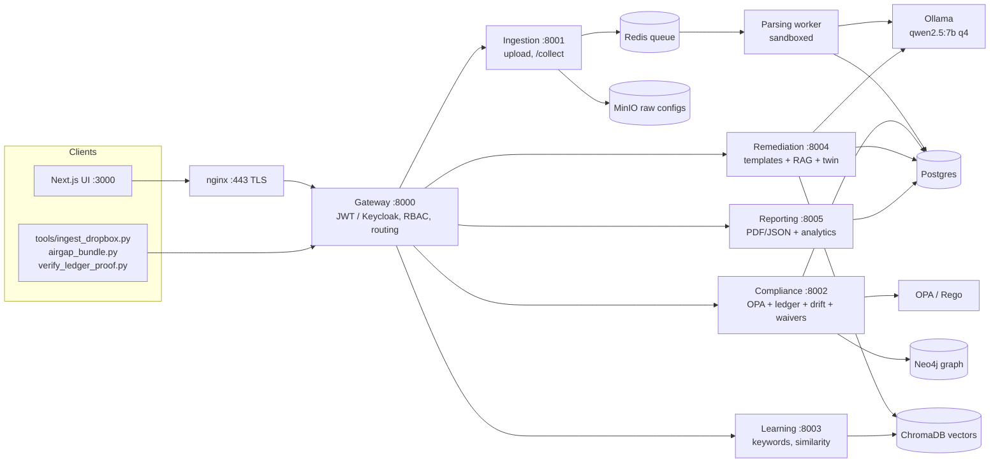
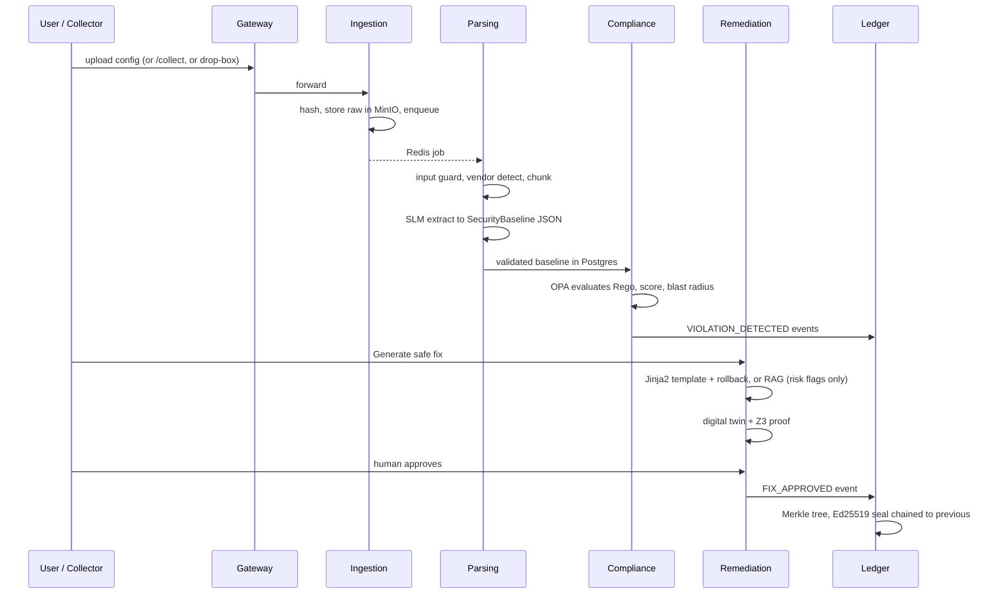
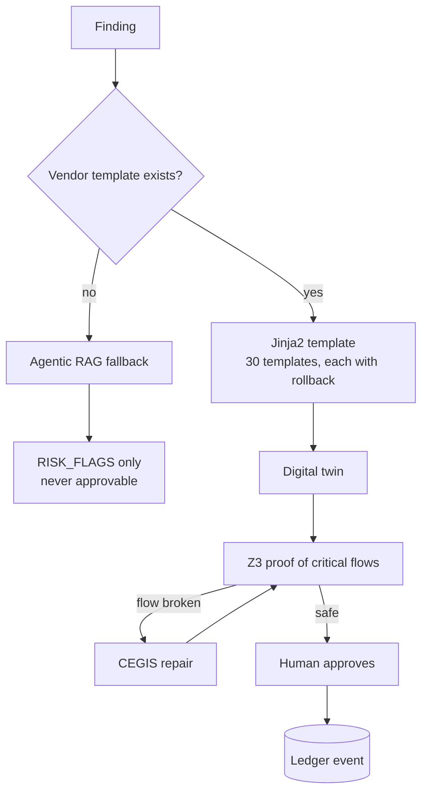

# NetAudit Engine: End-to-End Architecture

Problem Statement 26155 (NTRO). This document describes every component, the data flow between them, and each feature. Section 12 lists what is *not* real, so the claims here can be checked.

## 1. The one rule

**AI extracts. OPA decides.** The language model only turns raw vendor config text into a structured, schema-validated JSON document. Every compliance verdict is a deterministic Rego rule. The model never decides pass or fail, and it never approves a fix.

## 2. System map

| Service | Port | Responsibility |
|---|---|---|
| nginx | 443 | TLS termination in front of UI and API |
| frontend | 3000 | Next.js single-page workspace |
| gateway | 8000 | The only public API: auth, roles, routing, long-call timeouts (250 s) |
| ingestion | 8001 | File upload, offline drop-box, optional live collection |
| parsing | worker | Vendor detection, SLM extraction, schema validation (sandboxed) |
| compliance | 8002 | OPA evaluation, scoring, ledger, drift, topology, waivers |
| remediation | 8004 | Fix proposals, rollback scripts, digital twin, Z3 verification |
| reporting | 8005 | Executive and per-run reports, FFT cycle analysis, time sync |
| learning | 8003 | Keyword extraction, similarity map, human-taught mappings |

Docker Compose profiles keep the default stack small: `advanced` (neo4j, chromadb, learning, batfish), `model` (ollama), `iam` (keycloak), `secrets` (vault), `time` (chrony NTP). Fluent Bit (SIEM forwarder) is in the default set.

## 3. Pipeline, step by step

1. **Ingest.** The file is hashed (SHA-256), stored in MinIO, and queued in Redis. Three entry routes share one code path (`_ingest()`): browser upload, `/collect` for live devices, and `tools/ingest_dropbox.py` for air-gapped transfer.
2. **Parse.** The input guard screens the text, the vendor is detected, and the model extracts a `SecurityBaseline` (contract in `contracts/security_baseline.schema.json`). A serial number and a device identity are also captured.
3. **Evaluate.** OPA runs `generic_level1.rego` against the baseline. Findings for the same control are merged (`merge_same_control`) so two hits on one control cannot collide. Each finding gets a severity, a risk score and a blast radius.
4. **Record.** Every violation becomes a ledger event.
5. **Remediate.** The user asks for a fix. The proposal is tested in the twin before a human can approve it.
6. **Report.** PDF and JSON reports, plus fleet analytics.

## 4. Ingestion and collection

- Upload of Cisco, Fortinet, Juniper, Arista and Palo Alto configs.
- **Offline drop-box** (`tools/ingest_dropbox.py`) for data-diode or air-gapped transfer.
- **Online collector** (`collector.py`): Netmiko and NAPALM, **off by default**, limited to allow-listed CIDRs.
- **Signed air-gap update bundle** (`tools/airgap_bundle.py`) for moving rules and templates across the gap, with a documented procedure in `docs/AIRGAP_UPDATE_PROCEDURE.md`.

## 5. Parsing and the adversarial-input defence

- **Vendor detection** runs in a killable subprocess, so a pathological input cannot hang the worker (ReDoS defence).
- **Input guard** (`input_guard.py`): caps line length and neutralises lines that look like prompt injection. The config is wrapped in `<<<BEGIN_CONFIG ... END_CONFIG>>>` so the model treats it as data.
- **Container hardening:** non-root, read-only filesystem, capabilities dropped (`docs/PARSER_SANDBOX.md`).
- **Model:** `qwen2.5:7b-instruct-q4_K_M` through Ollama, with a regex mock (`USE_MOCK_SLM=true`) for fast demos and tests.
- **Device identity:** `vendor|hostname`, or `sha:<hash>` when there is no hostname. This key ties history, waivers and drift to one device.

## 6. Compliance engine

- Deterministic Rego policy, CIS-inspired demo rules (not a certification claim).
- **Scoring** with severity weights, plus a per-control PASS / FAIL / WAIVED table (`control_results`).
- **Blast radius** from the Neo4j graph, and a **fleet topology** view.
- **Risk map** (`risk_map.py`): shortest path from the weakest device to the most connected one (BFS). It is graph search, not a neural network.
- **Control-theoretic model** (`control_model.py`): treats the network as a boolean reachability system. It reports reach per step, steps to core, and the minimum cut (max-flow) that would isolate it.
- **Counterfactual** (`fix_simulation.py`): recomputes the score as if a control were fixed.
- **Drift Time Machine** (`drift.py`): rebuilds a device's control state over time and diffs any run against a baseline.

## 7. Remediation

- **Templates** cover Cisco, Fortinet, Juniper, Palo Alto and Arista. Every template has an `@@ROLLBACK@@` section, so each approved fix ships with an automatic rollback script.
- **Digital twin** (`twin.py`): parses Cisco-style ACLs, interface bindings and routing neighbours, and replays the proposed change. Protected subnets come from `TWIN_PROTECTED_SUBNETS`.
- **Z3 verification** (`formal.py`): ACLs become bit-vector formulas with first-match semantics. The solver proves that flows that must stay open still pass. If a fix would break one, **CEGIS** searches for a repair and rejects any repair that admits traffic that must be blocked. Without `z3-solver` the twin falls back to sample-packet checks and says so in the UI.
- **Z3 verifies fixes. It does not produce the compliance verdict. OPA does.**

## 8. Tamper-evident ledger

- `ledger_events` holds violations, approvals and waivers.
- Events are hashed into a **Merkle tree** with domain separation between leaves and nodes.
- Each root is **Ed25519-signed** and **chained to the previous seal**, stored in `ledger_seals`, which a database trigger makes immutable.
- Keys come from `LEDGER_SIGNING_KEY` or `LEDGER_SIGNING_KEY_FILE`; a background sealer runs at startup.
- `/ledger/verify` re-checks the whole chain. `tools/verify_ledger_proof.py` checks a single event's inclusion proof **offline**, with no database.

## 9. Waivers

A waiver is a dated, reasoned exception for a failing control (an isolated legacy host, a honeypot).

- Admin-only, reason of at least 15 characters, maximum duration `WAIVER_MAX_DAYS` = 90.
- Stored as ledger events, so a grant cannot be quietly edited. Status (ACTIVE / EXPIRED / REVOKED) is computed at read time, so expiry needs no job.
- A waived finding is excluded from the score and from new alert webhooks, but stays in the evidence as a failure. Reports list it under "Waived Findings (Accepted Risk)" with approver, reason and expiry.

## 10. Reporting and analytics

- **PDF and JSON** per-run reports (WeasyPrint), with device identity, control table, time-sync state, waivers and security flags.
- **Executive report:** fleet score, score trend, per-device rows.
- **Cycle detection** (`spectral.py`, `periodicity.py`): radix-2 FFT with a Hann window and zero padding. The period comes from autocorrelation, spectral support from the periodogram, and a seeded permutation test (p <= 0.01) decides whether the cycle is real. Measured false-positive rate on random data: 0 in 300.
- **Version guidance** (`version_guidance.py`) for firmware and OS advice.
- **Time sync** (`timesync.py`): an SNTP clock check, shown as a badge, because audit evidence is only as good as its timestamps. Chrony runs under the `time` profile.

## 11. Learning service

- Keyword extraction and a similarity plot of configs (BGE embeddings in ChromaDB).
- Admins can queue unknown items and confirm a mapping (`/learning/queue`, `/learning/map`), so the system improves from human review rather than from unsupervised model output.

## 12. Identity, secrets, and SIEM

| Concern | Default | Optional |
|---|---|---|
| Auth | Local JWT, roles admin / viewer | Keycloak RS256 (`AUTH_PROVIDER=keycloak`, profile `iam`) |
| Secrets | Environment variables | HashiCorp Vault loader, inert unless `VAULT_ADDR` is set |
| SIEM | Fluent Bit emits CEF to stdout | Forward to a SIEM collector (`infra/fluent-bit/siem.conf`) |

## 13. Frontend

One workspace with these panels: upload, audit inventory, finding list with a slide-over detail drawer, history and drift, waiver panel and register, fix proposal with rollback and twin result, verification pipeline, trend chart, risk map, fleet topology, similarity plot, containment panel, ledger integrity card, time-sync badge and executive report. Light and dark themes are supported.

## 14. Data stores

| Store | Holds |
|---|---|
| Postgres | Audit runs, baselines, findings, evaluations, proposals, ledger events and seals, waivers, users |
| Redis | Parse job queue |
| MinIO | Raw uploaded configs |
| Neo4j | Device and dependency graph for blast radius |
| ChromaDB | Embeddings for RAG and similarity |

Migrations live in `infra/postgres/migrations/` (0011 to 0013 add seals, twin results and waiver events) and are mirrored in `init.sql`.

## 15. Honest limits

State these before anyone asks:

- **Batfish is mocked** (`USE_MOCK_BATFISH=true`).
- **No GNN, no Monte Carlo, no Critic agent.** The risk map is BFS, and the control model is max-flow.
- **The verdict is OPA, not Z3.** Z3 only verifies fixes.
- The model is a general `qwen2.5:7b-instruct` at 4-bit, not a "Coder" variant, and CPU inference is slow.
- The twin understands Cisco-style ACLs; other vendors get sample checks or template-level safety only.
- The executive fleet score does not yet account for waivers.
- Rules are CIS-inspired demo rules, not a certification.

See `docs/EVALUATION_ALIGNMENT.md` for the requirement-to-evidence map.
