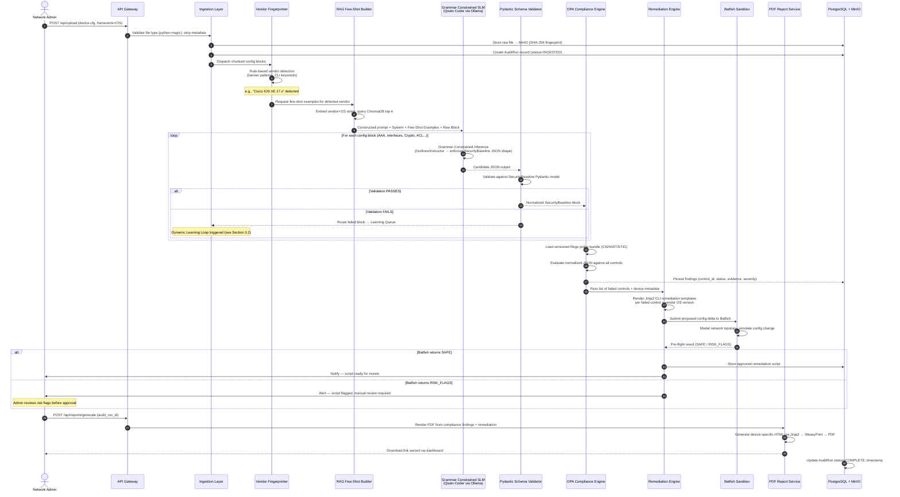
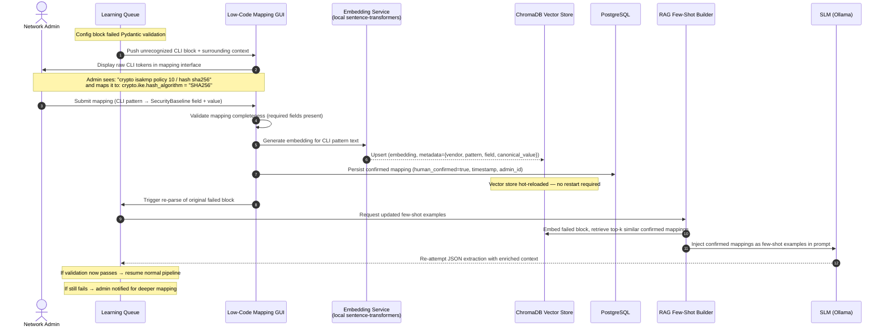
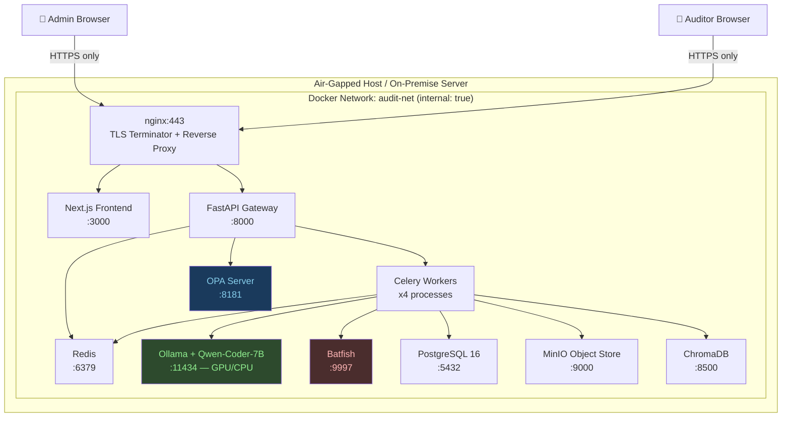

# AI-Driven Multi-Vendor Network Security Compliance Auditor
## Technical Architecture Blueprint & Design Document
### SIH 2026 — Problem Statement ID: 26155 | NTRO / Cybersecurity Theme

> **Classification:** Technical Architecture Specification  
> **Version:** 1.0  
> **Design Philosophy:** Separation of Concerns — Deterministic Rules vs. Probabilistic Parsing

---

## 1. Executive Architecture Summary

### 1.1 System Overview

The **NetAudit Engine** is a fully air-gapped, vendor-agnostic network security compliance platform designed to ingest raw device configuration files from heterogeneous enterprise hardware (Cisco IOS/NX-OS, Juniper JunOS, Palo Alto PAN-OS, Fortinet FortiOS, Arista EOS, SONiC, AWS/Azure Security Groups) and produce deterministic, auditable compliance verdicts against CIS Benchmarks, NIST SP 800-53, and DISA STIGs — without any external cloud dependency.

### 1.2 Core Design Philosophy: Separation of Concerns

The architecture enforces a hard boundary between two fundamentally different computational modes:

| Concern | Engine | Nature | Failure Mode |
|---|---|---|---|
| **Configuration Parsing & Normalization** | Local SLM (Qwen-Coder-7B via Ollama) + Grammar-Constrained Decoding | Probabilistic | Bounded by schema validator — rejects non-conforming output |
| **Compliance Evaluation** | OPA (Open Policy Agent) Rego Rules + Python RuleRunner | 100% Deterministic | Auditable, reproducible, court-admissible |
| **Remediation Script Generation** | Jinja2 Template Engine (deterministic) + Batfish sandbox pre-flight | Deterministic + Validated | Syntax/safety checked before exposure to operator |
| **Unknown Vendor Adaptation** | Dynamic Few-Shot RAG (ChromaDB + Instructor) | Probabilistic → Deterministic | Human-confirmed mapping before commit |

**Critical invariant:** The AI (SLM) **never** makes a compliance decision. It only transforms raw text into a structured JSON object. A deterministic rule engine then makes all pass/fail determinations.

### 1.3 Non-Functional Requirements

| Attribute | Target | Mechanism |
|---|---|---|
| **Air-Gap Compliance** | 100% — zero external API calls | Ollama on-prem, ChromaDB local, no telemetry |
| **Parsing Latency** | < 30s per device config (≤ 5,000 lines) | GCD-constrained SLM inference; chunked processing |
| **Compliance Throughput** | ≥ 50 devices/hour in batch mode | Async FastAPI workers, OPA native binary |
| **Hallucination Rate** | ≈ 0% on structured output | Outlines/Instructor schema enforcement + Pydantic v2 validation |
| **Learning Loop Latency** | < 5 min for admin to map + commit unknown syntax | Vector upsert + RAG hot-reload, no restart required |
| **Audit Trail** | Immutable, timestamped | PostgreSQL append-only audit log + SHA-256 config fingerprints |
| **Remediation Safety** | Zero lock-out risk | Batfish pre-flight + human approval gate before script delivery |

---

## 2. End-to-End System Architecture

### 2.1 C4 Component Diagram

```mermaid
C4Component
    title NetAudit Engine — Component Architecture (C4 Level 3)

    Person(admin, "Network Administrator", "Uploads configs, reviews findings, trains unknown syntax")
    Person(auditor, "Security Auditor", "Reviews PDF reports, tracks compliance posture")

    System_Boundary(ingestion, "Ingestion Layer") {
        Component(uploader, "File Upload API", "FastAPI + python-magic", "Validates file type, strips EXIF/metadata, deduplicates via SHA-256")
        Component(chunker, "AST Block Chunker", "Python / textfsm", "Splits monolithic configs into logical blocks: AAA, interfaces, routing, crypto")
        Component(queue, "Task Queue", "Celery + Redis", "Async job dispatch for parsing and compliance workers")
    }

    System_Boundary(parsing, "Parsing & Normalization Engine") {
        Component(vendor_detector, "Vendor Fingerprinter", "Rule-based + semantic similarity", "Identifies vendor/OS from banner, prompt style, known keywords")
        Component(slm, "Grammar-Constrained SLM", "Qwen-Coder-7B via Ollama + Outlines/Instructor", "Extracts structured fields; output constrained to Pydantic SecurityBaseline schema")
        Component(schema_validator, "Pydantic Schema Validator", "Pydantic v2", "Hard-rejects any SLM output that does not conform; routes failures to Learning Subsystem")
        Component(normalizer, "JSON Normalizer", "Python", "Maps vendor-specific values to canonical enum set (e.g., 'enable secret' → password_hash_algo: SHA256)")
    }

    System_Boundary(compliance, "Deterministic Compliance Engine") {
        Component(opa, "OPA Policy Evaluator", "Open Policy Agent + Rego", "Evaluates normalized JSON against CIS/NIST/STIG Rego bundles; returns pass/fail + control IDs")
        Component(rule_registry, "Compliance Rule Registry", "Git-versioned Rego files", "CIS Benchmarks, NIST SP 800-53, DISA STIGs as versioned policy bundles")
        Component(risk_scorer, "Risk Severity Scorer", "Python", "Maps failed controls to CVSS-like risk level: Critical / High / Medium / Low")
    }

    System_Boundary(learning, "Dynamic Learning Subsystem") {
        Component(unknown_handler, "Unparsed Token Handler", "Python", "Captures config blocks that failed schema validation")
        Component(mapping_ui, "Low-Code Mapping GUI", "React + FastAPI", "Admin maps raw CLI tokens to SecurityBaseline fields via drag-drop interface")
        Component(vector_db, "Vector Store", "ChromaDB (local)", "Stores semantic embeddings of known CLI patterns → schema field mappings")
        Component(rag_builder, "Dynamic Few-Shot RAG Builder", "LangChain + ChromaDB", "Retrieves top-k similar mappings and injects as few-shot examples into SLM prompt at runtime")
    }

    System_Boundary(remediation, "Remediation & Sandbox Layer") {
        Component(template_engine, "Remediation Template Engine", "Jinja2", "Generates vendor-specific CLI fix scripts from failed control IDs + device metadata")
        Component(batfish, "Batfish Pre-flight Validator", "Batfish (containerized)", "Simulates config changes in network model; flags lock-out / routing break risks")
        Component(approval_gate, "Human Approval Gate", "FastAPI + UI", "Holds remediation script delivery until operator explicitly approves post-Batfish")
    }

    System_Boundary(storage, "Data & Storage Layer") {
        ComponentDb(postgres, "Relational Store", "PostgreSQL", "Devices, configs, audit runs, compliance findings, user actions — append-only audit log")
        ComponentDb(chromadb, "Vector Store", "ChromaDB (local)", "CLI pattern embeddings for RAG-based few-shot learning")
        ComponentDb(object_store, "Config Object Store", "MinIO (local S3-compatible)", "Raw uploaded config files, SHA-256 indexed, immutable")
    }

    System_Boundary(presentation, "Presentation Layer") {
        Component(dashboard, "Web Dashboard", "Next.js 14 + Tailwind", "Compliance posture overview, device inventory, audit history, learning queue")
        Component(pdf_service, "PDF Report Service", "WeasyPrint + Jinja2 HTML templates", "Generates device-specific PDF: findings, risk scores, remediation scripts")
        Component(api_gateway, "API Gateway", "FastAPI + JWT Auth", "All backend services exposed through single authenticated gateway")
    }

    Rel(admin, uploader, "Uploads .cfg/.txt files (bulk or single)", "HTTPS/multipart")
    Rel(auditor, dashboard, "Reviews compliance dashboard & reports", "HTTPS")
    Rel(uploader, chunker, "Validated raw config")
    Rel(chunker, queue, "Chunked config blocks")
    Rel(queue, vendor_detector, "Dispatch parsing job")
    Rel(vendor_detector, slm, "Vendor-annotated chunks")
    Rel(slm, schema_validator, "Constrained JSON output")
    Rel(schema_validator, normalizer, "Valid schema instance")
    Rel(schema_validator, unknown_handler, "Failed blocks → learning queue")
    Rel(normalizer, opa, "Normalized SecurityBaseline JSON")
    Rel(opa, rule_registry, "Load policy bundles")
    Rel(opa, risk_scorer, "Failed control list")
    Rel(risk_scorer, template_engine, "Failed controls + device metadata")
    Rel(template_engine, batfish, "Proposed remediation script")
    Rel(batfish, approval_gate, "Pre-flight verdict + risk flags")
    Rel(approval_gate, admin, "Script presented for approval")
    Rel(unknown_handler, mapping_ui, "Unrecognized CLI blocks")
    Rel(mapping_ui, vector_db, "Confirmed CLI→schema mapping")
    Rel(rag_builder, vector_db, "Retrieve similar mappings")
    Rel(rag_builder, slm, "Inject few-shot examples into prompt")
    Rel(risk_scorer, postgres, "Persist findings")
    Rel(uploader, object_store, "Store raw config")
    Rel(postgres, dashboard, "Query compliance data")
    Rel(pdf_service, dashboard, "Serve PDF download link")
    Rel(admin, api_gateway, "All API interactions")
    Rel(api_gateway, uploader, "Route")
    Rel(api_gateway, compliance, "Route")
    Rel(api_gateway, learning, "Route")
```

---

## 3. Data Flow & Sequential Pipeline

### 3.1 Happy Path — Known Vendor Config



### 3.2 Learning Loop — Unknown Vendor Syntax



---

## 4. Universal Security Baseline Data Schema

### 4.1 Pydantic v2 Model (Python)

```python
from pydantic import BaseModel, Field, field_validator
from typing import Optional, List, Literal
from enum import Enum

# ── Enumerations ──────────────────────────────────────────────
class HashAlgorithm(str, Enum):
    MD5    = "MD5"
    SHA1   = "SHA1"
    SHA256 = "SHA256"
    SHA512 = "SHA512"
    NONE   = "NONE"
    UNKNOWN = "UNKNOWN"

class EncryptionAlgorithm(str, Enum):
    DES     = "DES"
    TDES    = "3DES"
    AES128  = "AES128"
    AES256  = "AES256"
    CHACHA  = "CHACHA20"
    NONE    = "NONE"
    UNKNOWN = "UNKNOWN"

class ProtocolStatus(str, Enum):
    ENABLED  = "ENABLED"
    DISABLED = "DISABLED"
    UNKNOWN  = "UNKNOWN"

class SNMPVersion(str, Enum):
    V1   = "v1"
    V2C  = "v2c"
    V3   = "v3"
    NONE = "none"

class SSHVersion(str, Enum):
    V1    = "1"
    V2    = "2"
    V1V2  = "1-2"
    NONE  = "none"

# ── Sub-schemas ───────────────────────────────────────────────

class AAAConfig(BaseModel):
    """Authentication, Authorization, Accounting"""
    authentication_method: List[str] = Field(
        default_factory=list,
        description="Ordered auth methods: ['tacacs+', 'local', 'radius']"
    )
    authorization_enabled: bool = False
    accounting_enabled: bool = False
    local_user_privilege_levels: List[int] = Field(
        default_factory=list,
        description="Privilege levels of configured local users (e.g., [15, 1])"
    )
    password_encryption: ProtocolStatus = ProtocolStatus.UNKNOWN
    password_min_length: Optional[int] = None
    password_complexity_enabled: bool = False

class SSHConfig(BaseModel):
    """Secure Shell configuration"""
    enabled: bool = False
    version: SSHVersion = SSHVersion.NONE
    idle_timeout_seconds: Optional[int] = None
    authentication_retries: Optional[int] = None
    allowed_ciphers: List[str] = Field(default_factory=list)
    allowed_macs: List[str] = Field(default_factory=list)
    allowed_kex: List[str] = Field(default_factory=list)
    management_acl: Optional[str] = None  # ACL name/ID restricting SSH source IPs

class TelnetConfig(BaseModel):
    enabled: ProtocolStatus = ProtocolStatus.UNKNOWN
    vty_lines_with_telnet: List[str] = Field(default_factory=list)

class SNMPConfig(BaseModel):
    """Simple Network Management Protocol"""
    enabled: bool = False
    version: SNMPVersion = SNMPVersion.NONE
    community_strings: List[str] = Field(
        default_factory=list,
        description="List of SNMP community strings — presence of 'public'/'private' is a finding"
    )
    auth_protocol: HashAlgorithm = HashAlgorithm.UNKNOWN     # SNMPv3
    priv_protocol: EncryptionAlgorithm = EncryptionAlgorithm.UNKNOWN  # SNMPv3
    trap_host: Optional[str] = None
    access_acl: Optional[str] = None

class LoggingConfig(BaseModel):
    """Syslog and local logging configuration"""
    syslog_enabled: bool = False
    syslog_hosts: List[str] = Field(default_factory=list)
    syslog_severity_level: Optional[int] = Field(
        None, ge=0, le=7,
        description="Syslog severity: 0=Emergency, 7=Debug"
    )
    local_buffer_enabled: bool = False
    local_buffer_severity: Optional[int] = None
    timestamps_enabled: bool = False
    source_interface: Optional[str] = None

class NTPConfig(BaseModel):
    """Network Time Protocol"""
    enabled: bool = False
    servers: List[str] = Field(default_factory=list)
    authentication_enabled: bool = False
    peer_auth_key_hash: HashAlgorithm = HashAlgorithm.UNKNOWN
    source_interface: Optional[str] = None

class ACLEntry(BaseModel):
    sequence: Optional[int] = None
    action: Literal["permit", "deny"]
    protocol: str
    source: str
    destination: str
    port: Optional[str] = None

class ACLConfig(BaseModel):
    """Access Control Lists"""
    ingress_acl_name: Optional[str] = None
    ingress_acl_applied: bool = False
    egress_acl_name: Optional[str] = None
    egress_acl_applied: bool = False
    ingress_entries: List[ACLEntry] = Field(default_factory=list)
    egress_entries: List[ACLEntry] = Field(default_factory=list)
    implicit_deny_present: bool = False

class CryptoIKEPolicy(BaseModel):
    """IKE/IPSec Phase 1 Policy"""
    policy_id: Optional[int] = None
    encryption: EncryptionAlgorithm = EncryptionAlgorithm.UNKNOWN
    hash_algorithm: HashAlgorithm = HashAlgorithm.UNKNOWN
    dh_group: Optional[int] = None  # Diffie-Hellman group number
    lifetime_seconds: Optional[int] = None
    authentication_method: Optional[str] = None

class CryptoConfig(BaseModel):
    """Cryptographic and VPN policy"""
    ike_policies: List[CryptoIKEPolicy] = Field(default_factory=list)
    pki_enabled: bool = False
    certificate_auth: bool = False
    weak_ciphers_detected: List[str] = Field(
        default_factory=list,
        description="Any detected weak ciphers: DES, MD5, DH group < 14"
    )

class BannerConfig(BaseModel):
    """Login/MOTD banners (legal notice requirement)"""
    login_banner_present: bool = False
    motd_banner_present: bool = False
    banner_text_snippet: Optional[str] = Field(
        None, max_length=200,
        description="First 200 chars of banner text for review"
    )

class ServiceConfig(BaseModel):
    """Miscellaneous service hardening"""
    http_server_enabled: ProtocolStatus = ProtocolStatus.UNKNOWN
    https_server_enabled: ProtocolStatus = ProtocolStatus.UNKNOWN
    cdp_enabled: ProtocolStatus = ProtocolStatus.UNKNOWN          # Cisco Discovery Protocol
    lldp_enabled: ProtocolStatus = ProtocolStatus.UNKNOWN
    finger_service_enabled: ProtocolStatus = ProtocolStatus.UNKNOWN
    ip_source_route_enabled: ProtocolStatus = ProtocolStatus.UNKNOWN
    proxy_arp_enabled: ProtocolStatus = ProtocolStatus.UNKNOWN
    ip_directed_broadcast: ProtocolStatus = ProtocolStatus.UNKNOWN
    tcp_small_servers: ProtocolStatus = ProtocolStatus.UNKNOWN
    udp_small_servers: ProtocolStatus = ProtocolStatus.UNKNOWN

# ── Root Schema ───────────────────────────────────────────────

class DeviceMetadata(BaseModel):
    raw_hostname: Optional[str] = None
    detected_vendor: str = Field(..., description="e.g., 'cisco', 'juniper', 'paloalto', 'arista'")
    detected_os: Optional[str] = Field(None, description="e.g., 'IOS-XE', 'JunOS', 'PAN-OS'")
    detected_os_version: Optional[str] = None
    detected_hardware_model: Optional[str] = None
    config_sha256: str = Field(..., description="SHA-256 of raw uploaded config file")
    parsing_confidence: float = Field(
        ..., ge=0.0, le=1.0,
        description="Normalized confidence score from SLM + RAG pipeline"
    )
    unknown_blocks_count: int = Field(
        0, description="Number of config blocks routed to learning queue"
    )

class SecurityBaseline(BaseModel):
    """
    Universal Security Baseline Model
    Vendor-neutral normalized representation of a network device's security configuration.
    This is the canonical schema fed to the OPA compliance engine.
    """
    schema_version: str = "1.0.0"
    device: DeviceMetadata

    # Core security domains
    aaa: AAAConfig = Field(default_factory=AAAConfig)
    ssh: SSHConfig = Field(default_factory=SSHConfig)
    telnet: TelnetConfig = Field(default_factory=TelnetConfig)
    snmp: SNMPConfig = Field(default_factory=SNMPConfig)
    logging: LoggingConfig = Field(default_factory=LoggingConfig)
    ntp: NTPConfig = Field(default_factory=NTPConfig)
    acl: ACLConfig = Field(default_factory=ACLConfig)
    crypto: CryptoConfig = Field(default_factory=CryptoConfig)
    banners: BannerConfig = Field(default_factory=BannerConfig)
    services: ServiceConfig = Field(default_factory=ServiceConfig)

    @field_validator("device")
    @classmethod
    def validate_confidence_threshold(cls, v):
        if v.parsing_confidence < 0.60:
            raise ValueError(
                f"Parsing confidence {v.parsing_confidence:.0%} below 60% threshold. "
                "Route to human review before compliance evaluation."
            )
        return v

    class Config:
        use_enum_values = True
        validate_assignment = True
```

### 4.2 Example Normalized JSON Output

```json
{
  "schema_version": "1.0.0",
  "device": {
    "raw_hostname": "CORE-SW-01",
    "detected_vendor": "cisco",
    "detected_os": "IOS-XE",
    "detected_os_version": "17.9.3",
    "detected_hardware_model": "Catalyst 9300",
    "config_sha256": "a3f2c8e1b4d7...",
    "parsing_confidence": 0.94,
    "unknown_blocks_count": 0
  },
  "aaa": {
    "authentication_method": ["tacacs+", "local"],
    "authorization_enabled": true,
    "accounting_enabled": true,
    "local_user_privilege_levels": [15],
    "password_encryption": "ENABLED",
    "password_min_length": 12,
    "password_complexity_enabled": true
  },
  "ssh": {
    "enabled": true,
    "version": "2",
    "idle_timeout_seconds": 300,
    "authentication_retries": 3,
    "allowed_ciphers": ["aes256-ctr", "aes128-ctr"],
    "allowed_macs": ["hmac-sha2-256"],
    "management_acl": "MGMT-SSH-ACL"
  },
  "telnet": {
    "enabled": "DISABLED",
    "vty_lines_with_telnet": []
  },
  "snmp": {
    "enabled": true,
    "version": "v3",
    "community_strings": [],
    "auth_protocol": "SHA256",
    "priv_protocol": "AES256",
    "access_acl": "SNMP-ACL"
  },
  "logging": {
    "syslog_enabled": true,
    "syslog_hosts": ["10.1.1.100"],
    "syslog_severity_level": 6,
    "local_buffer_enabled": true,
    "local_buffer_severity": 6,
    "timestamps_enabled": true
  },
  "crypto": {
    "ike_policies": [
      {
        "policy_id": 10,
        "encryption": "AES256",
        "hash_algorithm": "SHA256",
        "dh_group": 20,
        "lifetime_seconds": 86400
      }
    ],
    "weak_ciphers_detected": []
  }
}
```

---

## 5. Modular Tech Stack Matrix

| Component | Recommended Tool | Justification | Failover / Alternative |
|---|---|---|---|
| **API Gateway / Backend** | FastAPI (Python 3.11) | Async, OpenAPI auto-docs, native Pydantic integration; type-safe from day one | Flask + Marshmallow (heavier, slower) |
| **Task Queue / Async Workers** | Celery + Redis (local) | Proven at scale; per-device job isolation; retry/backoff built-in | RQ (simpler but less robust) |
| **Local SLM Inference** | Qwen-Coder-7B-Q4 via Ollama | Best code/config comprehension at ≤8B params; Q4 fits 8GB VRAM; no license restrictions | Llama-3.1-8B-Instruct via vLLM |
| **Grammar-Constrained Decoding** | Outlines (dottxt-ai) | Forces SLM to output exactly valid JSON matching Pydantic schema; zero hallucination on structure | Instructor (uses function-calling; slightly less strict) |
| **Schema Validation** | Pydantic v2 | 10–50× faster than v1; built-in field validators; direct OPA payload; type-safe throughout | Marshmallow (weaker type inference) |
| **Vendor Fingerprinting** | Rule-based (TextFSM NTC templates) + semantic similarity | NTC-templates cover 1,500+ CLI outputs; fallback to embedding similarity for unknowns | Genie (Cisco-only, less portable) |
| **Config Chunking / Parsing** | CiscoConfParse + custom Python | Block-aware hierarchical parsing; preserves parent-child context | Hierarchical regex (fragile) |
| **Compliance Engine** | Open Policy Agent (OPA) binary | Declarative Rego policies; versioned bundles; no Python logic mixing; auditable decision log | Python RuleRunner class (simpler, less auditable) |
| **Compliance Policy Bundles** | Git-versioned Rego files (CIS/NIST/STIG) | Each benchmark as a separate bundle; updatable without code change; signed commits | YAML rule definitions (less expressive) |
| **Vector Store (RAG)** | ChromaDB (local, persistent) | Zero-config embedded DB; fast semantic search; air-gap native; Python-native API | FAISS (faster retrieval, no metadata store) |
| **Embeddings (local)** | sentence-transformers/all-MiniLM-L6-v2 | 80MB, CPU-compatible, 384-dim embeddings sufficient for CLI pattern similarity | nomic-embed-text via Ollama |
| **Remediation Templates** | Jinja2 | Vendor-specific CLI templates per failed control; fully deterministic | Mako (similar capability) |
| **Network Simulation** | Batfish (containerized) | Industry-standard pre-flight config validation; models ACL/routing impact | Containerlab (topology-level, less ACL-aware) |
| **Relational Database** | PostgreSQL 16 | Audit-grade ACID, row-level security, JSON-B for finding storage | SQLite (dev/small-scale only) |
| **Config Object Store** | MinIO (local, S3-compatible) | Immutable object storage with SHA-256 integrity; S3 API portable | Local filesystem + checksums |
| **Frontend Dashboard** | Next.js 14 + Tailwind CSS | SSR for fast initial load; App Router for per-page auth; Tailwind for rapid UI | React + Vite (no SSR) |
| **PDF Report Engine** | WeasyPrint + Jinja2 HTML → PDF | CSS-styled, fully scriptable PDF; supports complex tables/charts; pure Python | ReportLab (lower-level, verbose), Puppeteer (requires Node) |
| **Authentication** | JWT + bcrypt (local user store) | No external IdP dependency for air-gap; roles: ADMIN, AUDITOR, READ-ONLY | LDAP integration (if org has local LDAP) |
| **Container Runtime** | Docker Compose (dev) → Kubernetes (prod) | Compose for rapid SIH prototype; K8s manifests for production air-gap deployment | Podman Compose (rootless, RHEL-compatible) |

---

## 6. Failure Modes, Edge Cases & Security Mitigations

### 6.1 Failure Mode Analysis

| Failure Mode | Probability | Impact | Detection | Mitigation |
|---|---|---|---|---|
| **SLM token window overflow** (config > 8K tokens) | High — enterprise configs routinely 5K–15K lines | Truncated output, missed findings | Block chunker reports `chunk_count > 1` | Hierarchical chunking: parse each logical block independently; merge results |
| **SLM hallucination of values** | Low (bounded by GCD) | False compliance reading | Pydantic strict validation rejects unexpected values | Grammar-Constrained Decoding + enum-bound fields; any non-enum value → `UNKNOWN` |
| **Vendor fingerprint failure** | Medium (new/rare vendor) | Wrong few-shot examples injected | `parsing_confidence < 0.60` detected | Route to manual vendor selection UI; human confirms vendor before re-parse |
| **OPA Rego policy version mismatch** | Low | Wrong compliance verdict | Policy bundle signed with version hash | OPA bundle version pinned per AuditRun; findings immutably reference policy version |
| **Remediation script causes lock-out** | Low but catastrophic | Device unreachable | Batfish pre-flight simulation | Batfish validates SSH/management ACL continuity; blocks script delivery if mgmt access disrupted |
| **Remediation script breaks routing** | Low | Network outage | Batfish routing model check | Batfish models BGP/OSPF impact of ACL changes; flags route withdrawal |
| **Config file contains secrets** | High — passwords in configs | Secret exposure in logs/DB | python-magic + regex scanner on ingest | Strip/redact password/key fields before object store; store only hash evidence for compliance |
| **ChromaDB vector drift** (stale embeddings) | Medium (long-running system) | RAG retrieves wrong few-shot | Periodic embedding freshness audit | Version-stamp all embeddings; re-embed on model/template change |
| **Concurrent audit write conflict** | Medium (batch mode) | DB corruption, duplicate findings | PostgreSQL serializable isolation | Per-AuditRun row lock; idempotent job dispatch via Celery task ID |
| **Monolithic config (10K+ lines)** | Medium (Nexus, Juniper SRX) | Memory exhaustion in worker | Worker memory limit + alerting | Stream-parse in 1K-line windows; process blocks as generator; never load full file in memory |

### 6.2 Security Mitigations

```
┌─────────────────────────────────────────────────────────────────┐
│                    DEFENSE-IN-DEPTH LAYERS                      │
├─────────────────────────────────────────────────────────────────┤
│ L1 — Upload Boundary                                            │
│   • python-magic MIME validation (reject non-text masquerading) │
│   • File size cap: 50MB per upload                              │
│   • SHA-256 deduplication (reject already-audited identical cfg)│
│   • Regex scan for credentials → redact before storage          │
├─────────────────────────────────────────────────────────────────┤
│ L2 — Process Isolation                                          │
│   • Each parse job in isolated Celery worker process            │
│   • SLM (Ollama) sandboxed in Docker with no network egress     │
│   • MinIO object store: immutable (WORM policy) after upload    │
├─────────────────────────────────────────────────────────────────┤
│ L3 — Schema Enforcement                                         │
│   • Pydantic v2 strict mode: no extra fields allowed            │
│   • All SLM outputs must round-trip through schema validator    │
│   • Compliance engine receives ONLY validated JSON — never raw  │
├─────────────────────────────────────────────────────────────────┤
│ L4 — Remediation Safety                                         │
│   • Batfish pre-flight is MANDATORY — not optional              │
│   • Human approval gate: remediation scripts never auto-applied │
│   • Scripts delivered as read-only, time-limited download links │
├─────────────────────────────────────────────────────────────────┤
│ L5 — Audit Integrity                                            │
│   • PostgreSQL append-only audit log (triggers block UPDATE/DELETE)│
│   • Every finding references: config SHA-256, policy version,   │
│     SLM model version, timestamp, operator ID                  │
│   • Exportable SIEM-compatible audit trail (JSON/CEF format)    │
├─────────────────────────────────────────────────────────────────┤
│ L6 — Air-Gap Enforcement                                        │
│   • Docker network: `internal: true` — no external internet     │
│   • Ollama: OLLAMA_HOST=127.0.0.1 only                         │
│   • All model weights pre-loaded; no pull-on-demand             │
│   • Outbound firewall rule: block all egress from worker subnet │
└─────────────────────────────────────────────────────────────────┘
```

### 6.3 Ambiguous Vendor Syntax Edge Cases

| Scenario | Example | Handling Strategy |
|---|---|---|
| **Same keyword, different semantics** | `service password-encryption` (Cisco: encrypts stored passwords) vs. `set system services` (Juniper: enables daemons) | Vendor context from fingerprinter passed as mandatory prompt prefix; keyword never evaluated in isolation |
| **Hierarchical config indentation variance** | JunOS uses deep `{}` nesting; IOS uses flat `!`-delimited blocks | Block chunker uses vendor-specific delimiter rules; JunOS parsed with `jnpr.junos` library natively |
| **Multi-line ACL with implicit deny** | Cisco extended ACL final `deny any any` sometimes omitted | OPA Rego rule checks: if `implicit_deny_present=false` AND ACL is non-empty → WARN finding |
| **SONiC / White-box JSON-native config** | SONiC uses `config_db.json` not CLI text | Separate ingestor path: JSON directly parsed to SecurityBaseline (bypass SLM; use jq/Python dict mapping) |
| **Cloud Security Group (AWS/Azure)** | JSON/YAML policies with ARNs, security-group IDs | Dedicated normalizer module: maps SG ingress/egress rules to `ACLConfig` schema fields |
| **Encrypted password in config** | `enable secret 5 $1$xyz...` (MD5 hash) | Detect hash type by prefix; store `password_encryption: ENABLED` + `hash_algo: MD5`; MD5 → FAIL finding |

---

## 7. OPA Rego Policy — Sample Rules

```rego
# cis_ios_level1.rego — CIS Cisco IOS Benchmark Level 1 (illustrative subset)
package compliance.cis.cisco_ios.level1

import future.keywords.if
import future.keywords.in

# ── CIS Control 1.1.1 — SSH version 2 must be enabled ──────────────
deny[finding] {
    input.ssh.version != "2"
    finding := {
        "control_id":   "CIS-IOS-1.1.1",
        "framework":    "CIS",
        "title":        "Ensure SSH version 2 is configured",
        "status":       "FAIL",
        "severity":     "HIGH",
        "evidence":     sprintf("ssh.version = %v", [input.ssh.version]),
        "remediation":  "ios_ssh_v2_fix.j2"
    }
}

# ── CIS Control 1.1.2 — Telnet must be disabled ─────────────────────
deny[finding] {
    input.telnet.enabled == "ENABLED"
    finding := {
        "control_id":   "CIS-IOS-1.1.2",
        "framework":    "CIS",
        "title":        "Ensure Telnet is not used for management access",
        "status":       "FAIL",
        "severity":     "CRITICAL",
        "evidence":     sprintf("telnet.enabled = %v", [input.telnet.enabled]),
        "remediation":  "ios_disable_telnet.j2"
    }
}

# ── CIS Control 1.2.1 — SNMPv1/v2c must not be used ────────────────
deny[finding] {
    input.snmp.version in ["v1", "v2c"]
    finding := {
        "control_id":   "CIS-IOS-1.2.1",
        "framework":    "CIS",
        "title":        "Ensure SNMP is not using version 1 or 2c",
        "status":       "FAIL",
        "severity":     "HIGH",
        "evidence":     sprintf("snmp.version = %v", [input.snmp.version]),
        "remediation":  "ios_snmp_v3_fix.j2"
    }
}

# ── CIS Control 1.2.2 — Default community strings ───────────────────
deny[finding] {
    community := input.snmp.community_strings[_]
    community in ["public", "private"]
    finding := {
        "control_id":   "CIS-IOS-1.2.2",
        "framework":    "CIS",
        "title":        "Ensure default SNMP community strings are not used",
        "status":       "FAIL",
        "severity":     "CRITICAL",
        "evidence":     sprintf("Default community string detected: %v", [community]),
        "remediation":  "ios_snmp_community_fix.j2"
    }
}

# ── CIS Control 1.3.1 — Weak IKE encryption ─────────────────────────
deny[finding] {
    policy := input.crypto.ike_policies[_]
    policy.encryption in ["DES", "3DES"]
    finding := {
        "control_id":   "CIS-IOS-1.3.1",
        "framework":    "CIS",
        "title":        "Ensure IKE policy does not use DES or 3DES encryption",
        "status":       "FAIL",
        "severity":     "CRITICAL",
        "evidence":     sprintf("IKE policy %v uses %v", [policy.policy_id, policy.encryption]),
        "remediation":  "ios_ike_encryption_fix.j2"
    }
}

# ── CIS Control 1.4.1 — NTP authentication ──────────────────────────
deny[finding] {
    input.ntp.enabled == true
    input.ntp.authentication_enabled == false
    finding := {
        "control_id":   "CIS-IOS-1.4.1",
        "framework":    "CIS",
        "title":        "Ensure NTP authentication is enabled",
        "status":       "FAIL",
        "severity":     "MEDIUM",
        "evidence":     "NTP is enabled but authentication is disabled",
        "remediation":  "ios_ntp_auth_fix.j2"
    }
}
```

---

## 8. Remediation Template Example (Jinja2)

```jinja2
{# ios_ssh_v2_fix.j2 — Cisco IOS-XE: Enforce SSH v2 #}
{# Control: CIS-IOS-1.1.1 | Severity: HIGH #}
{# Pre-flight: Batfish validates management access preserved #}

! ============================================================
! REMEDIATION SCRIPT — {{ device.raw_hostname }}
! Control:  CIS-IOS-1.1.1 — SSH Version 2 Enforcement
! Generated: {{ timestamp }} | Audit Run: {{ audit_run_id }}
! WARNING: Review Batfish pre-flight report before applying.
!          Verify management SSH access from admin subnet.
! ============================================================

configure terminal
!
! Step 1: Set SSH version 2 (disables SSHv1 negotiation)
ip ssh version 2
!
! Step 2: Set recommended SSH timeout and retry parameters
ip ssh time-out 60
ip ssh authentication-retries 3
!
! Step 3: Disable SSH v1 RSA keypair if present (Cisco CSCum35027)

! Recommended for IOS >= 15.6: use named keypair
crypto key generate rsa modulus 4096 label SSH-KEY-RSA
ip ssh rsa keypair-name SSH-KEY-RSA

!
! Step 4: Apply management ACL to VTY lines
line vty 0 15
 transport input ssh
 
 access-class {{ ssh.management_acl }} in
 
 ! WARNING: No management ACL configured. 
 ! Define an ACL to restrict SSH source IPs before applying.
 
 exec-timeout 10 0
!
end
!
! Verification commands (run post-change):
! show ip ssh
! show running-config | section line vty
! show running-config | include ip ssh
```

---

## 9. Deployment Architecture



---

## Appendix A: Key Integration Points Summary

| Integration | Protocol | Auth | Notes |
|---|---|---|---|
| Ollama ↔ FastAPI Worker | HTTP (localhost) | None (internal) | Model pre-loaded; no internet pull |
| OPA ↔ FastAPI | HTTP REST `/v1/data` | Bearer token | Policy bundles loaded from local volume |
| ChromaDB ↔ Worker | Python client (gRPC) | None (internal) | Persistent volume mounted |
| Batfish ↔ Worker | Python `pybatfish` client | None (internal) | Snapshot uploaded via API |
| MinIO ↔ Worker | S3-compatible API | Access key/secret | Internal network only |
| FastAPI ↔ PostgreSQL | `asyncpg` | SSL + password | Row-level security per org tenant |

## Appendix B: SIH Deliverable Checklist

| Deliverable | File | Notes |
|---|---|---|
| Source Code | `github.com/<team>/netaudit-engine` | MIT or Apache-2.0 |
| README + Setup | `README.md` | Docker Compose one-command setup |
| Architecture Doc | This document (2-page executive summary export) | Max 2 pages per SIH requirement |
| Demo Video | `demo.mp4` | Max 2 min: upload → parse → OPA verdict → PDF |
| Technical Slides | `presentation.pptx` | 5 slides: Problem, Architecture, Demo, Innovation, Team |

---

*Document Version 1.0 — SIH 2026 PS 26155 — NTRO / Cybersecurity Theme*  
*Design Philosophy: Deterministic Compliance. Probabilistic Parsing. Zero External Dependencies.*
